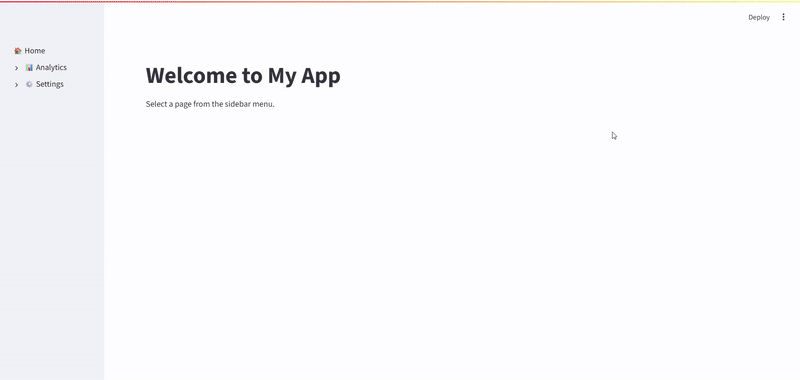

# Sidebar Accordion Menu

A Streamlit custom component that creates beautiful sidebar accordion menus with page navigation support.



## Installation

```bash
pip install streamlit-sidebar-accordion-menu
```

## Quick Start

Create a simple multi-page Streamlit app with an accordion menu.

### Project Setup
Here’s the recommended directory structure for your Streamlit app when use this component.


```
root/
├── app.py                         # Main entry point (Home page)
├── pages/                         # All subpages go here
│   ├── sales_dashboard.py
│   ├── user_analytics.py
│   ├── general_settings.py
│   └── advanced_settings.py
└── .streamlit/
    └── config.toml               # Optional config to hide Streamlit's default nav
```

#### Notes
* `app.py`
    This is your main app file. It defines the overall layout and the sidebar menu.
    You can name it anything(e.g., main.py, home.py, etc.).

* `pages/` directory
    Place all your subpage scripts here. The component automatically resolves paths like "sales_dashboard" to pages/sales_dashboard.py.

* `.streamlit/config.toml`
    To disable Streamlit’s default page navigation, set

```toml
[client]
showSidebarNavigation = false
```

Now you're ready to build!


### 1. Main App File

```python
import streamlit as st
from sidebar_accordion_menu import sidebar_accordion_menu

st.set_page_config(
    page_title="My App",
    layout="wide",
    initial_sidebar_state="expanded"
)

# Simple dictionary format - NEW! 🎉
menu = {
    "🏠 Home": None,  # None or "home" for main page
    "📊 Analytics": {
        "Sales Dashboard": "sales_dashboard",  # .py extension added automatically
        "User Analytics": "user_analytics",
    },
    "⚙️ Settings": {
        "General": "general_settings",
        "Advanced": "advanced_settings",
    }
}

# Render the accordion menu
sidebar_accordion_menu(menu)

# Your main page content
st.title("Welcome to My App")
st.write("Select a page from the sidebar menu.")
```

### 2. Create Your Pages

Create a `pages` directory and add your page files.

**pages/sales_dashboard.py:**
This is the sample implementation of `sales_dashboard.py`.
Please create the other scripts yourself as needed.
```python
import streamlit as st
from sidebar_accordion_menu import sidebar_accordion_menu

# Use the same menu structure (dict format)
menu = {
    "🏠 Home": None,
    "📊 Analytics": {
        "Sales Dashboard": "sales_dashboard",
        "User Analytics": "user_analytics",
    },
    "⚙️ Settings": {
        "General": "general_settings",
        "Advanced": "advanced_settings",
    }
}

sidebar_accordion_menu(menu)

# Page content
st.title("Sales Dashboard")
st.write("Overview of your sales performance and key metrics.")

# Key metrics
col1, col2, col3 = st.columns(3)
col1.metric("Total Sales", "$10,234", "+12%")
col2.metric("Active Customers", "1,234", "+8%")
col3.metric("Conversion Rate", "4.5%", "+0.3%")

# Sales trend chart
st.subheader("Monthly Sales Trend")
sales_data = {
    "Month": ["Jan", "Feb", "Mar", "Apr", "May", "Jun"],
    "Sales": [1500, 1800, 1700, 2100, 2300, 2500]
}
st.line_chart(data=sales_data, x="Month", y="Sales")

# Top products table
st.subheader("Top Selling Products")
st.table({
    "Product": ["Product A", "Product B", "Product C"],
    "Units Sold": [320, 280, 150],
    "Revenue": ["$3,200", "$2,800", "$1,500"]
})
```

## Hiding Default Streamlit Pages

To hide Streamlit's default page navigation, create a `.streamlit/config.toml` file:

```toml
[client]
showSidebarNavigation = false
```

## Features

- 🎨 Clean, modern design
- 📱 Responsive and user-friendly
- ⌨️ Keyboard navigation support
- ♿ Accessibility features (ARIA labels)
- 🚀 Optimized performance
- 🔧 Easy to customize

## Tips

1. **Consistent Menu**: Use the same menu structure across all pages for consistency
2. **Page Organization**: Keep your pages in a `pages/` directory
3. **Icons**: Use emojis or Unicode symbols to make your menu more visual
4. **Auto-detection**: The component automatically detects your main script

## Troubleshooting

### Menu not showing
- Make sure you call `sidebar_accordion_menu()` on every page
- Check that your page files are in the correct location

### Navigation not working
- Ensure page paths are relative to your main app file
- File names must end with `.py`


## License

MIT License - feel free to use in your projects!